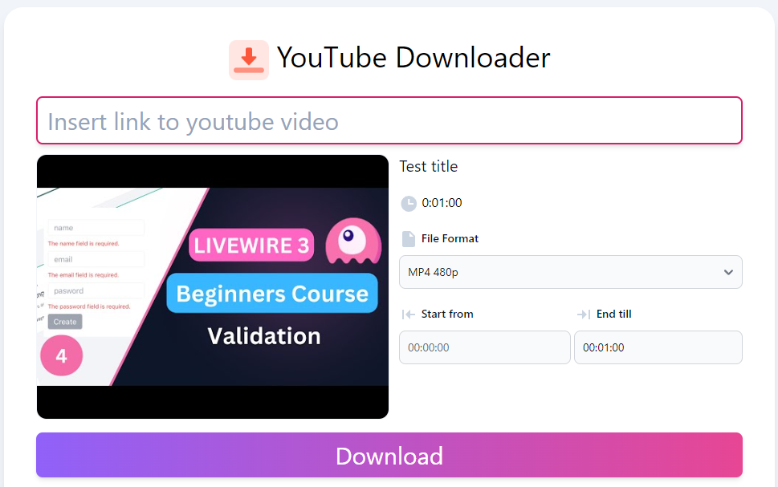

# YouTube Downloader Video & MP3

This is a Laravel 10 + Livewire 3 project that allows you to quickly deploy your own service to download videos or mp3s from YouTube, with the ability to choose the video format and time period.

It's my learning project that was created while learning how Livewire works.



👀 See the DEMO: http://yt.nitiweb.net/

## Used packages and extensions

* [YT-DLP](https://github.com/yt-dlp/yt-dlp)
* [Livewire](https://livewire.laravel.com/docs/installation)
* [Blade UI Kit](https://blade-ui-kit.com/docs/0.x/installation)
* [Flowbite](https://flowbite.com/docs/getting-started/quickstart/)

Also includes jQuery + timepicker.js

Tested on Windows 10 with XAMPP (PHP 8.1, Mysql), Node.js for npm

## Installation

Copy the repository, then run `composer update`

* YT-DLP 

Depends on your system. For Windows, you need to download yt-dlp.exe and ffmpeg.exe and place them in the same folder.

Then run command prompt in the folder and run the command:
``` 
yt-dlp --skip-download --print "%(duration>%H:%M:%S)s %(creator)s %(uploader)s %(title)s" URL
``` 
By replacing the URL with any YouTube video.

If you get a response with the title of the video, then everything is working correctly!

After that copy .env.example to .env, specify your database parameters.

## Deleting files

This script using Queue for deleting files, so you need to run commands:
``` 
php artisan migrate
```
And after that run command:
``` 
php artisan queue:listen
```

Generate unique key `php artisan key:generate`

Run command `npm install`

Then `npm run dev` for localhost OR `npm run build` for production 😉

## Author

- Evgenii Orel
- Email: evgen@nitiweb.net
- Linkedin: https://www.linkedin.com/in/evgeniiorel
